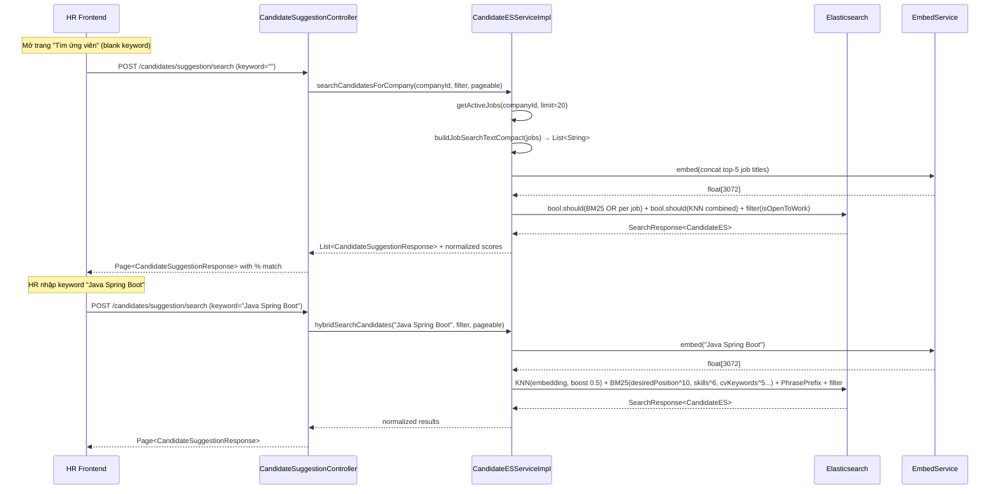

# V2 HR Search — Cải thiện tìm ứng viên cho HR

## 1. Bối cảnh hiện tại

### 1.1 Flow hiện tại (CandidateSuggestionController)

```
HR mở trang "Tìm ứng viên"
  ├── Không có keyword → searchCandidatesForCompany(companyId, filter, pageable)
  │     → Lấy 50 active jobs của company
  │     → buildJobSearchText(job) = title + description + qualifications + responsibilities
  │     → hybridSearchCandidatesForCompany(jobSearchTexts, filter, pageable)
  │         ├── BM25: OR mỗi jobSearchText → multi_match (desiredPosition^10, currentJobTitle^7, skills^6, summary^3, resumeText^2)
  │         ├── KNN: embed(mỗi jobSearchText) → knn search embedding (boost 0.7)
  │         └── Filter: isOpenToWork = true + postFilter(filter)
  │
  └── Có keyword → hybridSearchCandidates(keyword, filter, pageable)
        ├── KNN: embed(keyword) → knn(embedding, boost 0.5)
        ├── BM25: multi_match BestFields (desiredPosition^10, currentJobTitle^7, skills^6, summary^3, resumeText^2, boost 1.0)
        ├── PhrasePrefix: (desiredPosition^10, currentJobTitle^7, skills^5, resumeText^1.5, boost 1.5)
        └── Filter: isOpenToWork = true
```

### 1.2 Dữ liệu trong CandidateES index

| Field | Nguồn | Mô tả |
|-------|--------|--------|
| `desiredPosition` | Tiêu chí tìm việc (Candidate entity) | Vị trí mong muốn ứng viên tự nhập |
| `currentJobTitle` | Profile thông tin | Vị trí hiện tại |
| `skills` | Profile → CandidateSkill | Danh sách kỹ năng |
| `summary` | Profile | Tóm tắt bản thân |
| `resumeText` | File entity → `resumeExtractedText` (shareToFindJob=true) | Raw CV text (~4000 chars) |
| `embedding` | `buildSearchText()` = desiredPosition + currentJobTitle + skills + summary + resumeText(4000) | Vector 3072 dims |
| `industries`, `locations`, `workTypes` | Tiêu chí tìm việc | Keyword filters |
| `isOpenToWork` | Profile toggle | Hard filter |

### 1.3 `buildSearchText()` hiện tại (cho embedding)

```java
desiredPosition + currentJobTitle + skills + summary + resumeText(4000 chars)
```

→ Embedding bị pha loãng bởi raw CV text dài, không tập trung vào professional signal.

---

## 2. Vấn đề phát hiện

### 2.1 `buildJobSearchText` — Query keyword quá dài

Khi HR không nhập keyword, hệ thống dùng `buildJobSearchText(job)` gồm:
```
title + description + qualifications + minimumQualifications + responsibilities
```

Mỗi job có thể là **2000-5000 chars** → 50 jobs = 50 lần query quá dài → BM25 `minimumShouldMatch("30%")` match quá dễ, kết quả không chính xác.

**Vấn đề:** Job description/qualifications chứa nhiều generic phrases ("ability to work in team", "good communication") → match với gần như TẤT CẢ ứng viên → không phân biệt được ai fit nhất.

### 2.2 `resumeText` — 4000 chars raw text trong index

- CV text chứa noise (thông tin cá nhân, format headers, dates)
- BM25 scoring trên resumeText bị dilute 
- Embedding generation từ text quá dài → vector representation không focus

### 2.3 Thiếu trường `cvKeywords` trong CandidateES

V2 Job Personalization đã implement `CvKeywordsExtractionService` lưu `File.cvKeywordsJson`, nhưng **CandidateES index chưa có trường này** → HR search chưa tận dụng được keywords đã extract.

### 2.4 Không phân biệt case ứng viên

Hiện tại cùng 1 cấu trúc search cho mọi case:
- Ứng viên chỉ có tiêu chí tìm việc (chưa upload CV) → `resumeText` rỗng, embedding chỉ từ intent
- Ứng viên có CV nhưng chưa cập nhật tiêu chí → `desiredPosition` rỗng, CV là signal chính
- Ứng viên có cả hai → cần ưu tiên đúng

### 2.5 Score không normalize — khó hiểu cho HR

ES raw score phụ thuộc vào query complexity, không đại diện % match thực tế.

---

## 3. Các Case cần cover

| Case | Tiêu chí tìm việc | CV uploaded | Kỳ vọng khi HR search |
|------|-------------------|-------------|----------------------|
| **A** | Có (desiredPosition="Frontend Dev", skills=[React, TypeScript]) | Chưa upload | Match tốt khi HR search "Frontend Developer" → dựa vào intent signals |
| **B** | Chưa cập nhật | CV uploaded: Java Backend Dev, Spring Boot, 3 năm | Match khi HR search "Java Developer" → dựa vào CV keywords |
| **C** | desiredPosition="Data Analyst" | CV: Java Backend experience | HR search "Data Analyst" → match vì intent ưu tiên; HR search "Java" → match yếu hơn vì chỉ CV evidence |
| **D** | desiredPosition="Java Developer" | CV: Java Backend, Spring Boot | HR search "Java Developer" → match RẤT TỐT (intent + CV cùng hướng) |
| **E** | desiredPosition="Frontend Dev" | 2 CV: 1 Java Backend, 1 React Frontend | HR search "React" → match tốt; intent + CV2 đồng nhất |
| **F** | Có đầy đủ | CV mới upload nhưng CvKeywords chưa extract xong | Dùng intent signals, fallback heuristic keywords |
| **G** | Trống + isOpenToWork = true | CV uploaded với keywords | HR search → ưu tiên cvKeywords |

---

## 4. Thiết kế giải pháp

### 4.1 Thêm field `cvKeywords` vào CandidateES

```java
@Field(type = FieldType.Text, analyzer = "vi_analyzer")
private String cvKeywords;  // Extracted keywords từ CV (~300 chars, clean)
```

**Nguồn:** `File.cvKeywordsJson` → parse `searchKeywords` field.

**Update khi nào:**
- Sau `CvKeywordsExtractionService` persist `cvKeywordsJson` thành công
- Publish event → CandidateES re-index

### 4.2 Cải thiện `buildSearchText()` cho embedding

```java
public String buildSearchText() {
    StringBuilder sb = new StringBuilder();
    // Intent signals (ưu tiên cao — repeat 2x cho embedding weight)
    if (desiredPosition != null) {
        sb.append(desiredPosition).append(" ").append(desiredPosition).append(" ");
    }
    if (currentJobTitle != null) {
        sb.append(currentJobTitle).append(" ");
    }
    if (skills != null && !skills.isEmpty()) {
        sb.append(String.join(" ", skills)).append(" ");
    }
    // CV keywords thay vì raw resumeText
    if (cvKeywords != null && !cvKeywords.isBlank()) {
        sb.append(cvKeywords);
    } else if (resumeText != null && !resumeText.isBlank()) {
        // Fallback: chỉ 500 chars đầu nếu chưa có cvKeywords
        String snippet = resumeText.length() > 500 ? resumeText.substring(0, 500) : resumeText;
        sb.append(snippet);
    }
    return sb.toString().trim();
}
```

**Lợi ích:** Embedding vector tập trung vào professional signals, tối đa ~600 chars thay vì 4000+.

### 4.3 Cải thiện `buildJobSearchText()` — Query ngắn gọn hơn

```java
private String buildJobSearchText(Job job) {
    if (job == null) return null;
    StringBuilder sb = new StringBuilder();
    // CHỈ dùng title + top qualifications (không description full)
    if (StringUtils.hasText(job.getTitle())) {
        sb.append(job.getTitle()).append(" ");
    }
    // Top 3 qualifications/requirements (thường chứa tech keywords)
    appendTopLines(sb, job.getMinimumQualifications(), 3);
    appendTopLines(sb, job.getQualifications(), 3);
    return sb.toString().trim();
}
```

**Lợi ích:** Mỗi job search text ~200-400 chars thay vì 2000-5000 chars → BM25 scoring chính xác hơn.

### 4.4 Chiến lược BM25 field weighting mới

```
desiredPosition^10   — Intent signal: vị trí mong muốn (cao nhất)
currentJobTitle^7    — Evidence: đang làm gì
skills^6             — Evidence: kỹ năng cụ thể
cvKeywords^5         — CV extracted keywords (THÊM MỚI, sạch hơn resumeText)
summary^3            — Tóm tắt (thường generic)
resumeText^1         — Raw CV (giảm từ 2 xuống 1, chỉ backup)
```

**cvKeywords^5** thay thế phần lớn vai trò của `resumeText^2` hiện tại — signal sạch, ngắn, focused.

### 4.5 Score normalization — % Match cho HR

Thêm logic normalize ES raw score thành percentage:

```java
/**
 * Normalize ES score thành % match (0-100).
 * Dùng min-max normalization trên batch results.
 */
private float normalizeScore(float rawScore, float maxScore) {
    if (maxScore <= 0) return 0f;
    // Scale to 0-100, với floor 20% (nếu đã qua filter thì ít nhất 20% relevant)
    float normalized = (rawScore / maxScore) * 80f + 20f;
    return Math.min(normalized, 100f);
}
```

**Trả về:** `score` field trong `CandidateSuggestionResponse` sẽ là % (0-100) thay vì raw float.

### 4.6 Chiến lược search theo context

#### Case 1: HR không nhập keyword (Auto-suggest)

```
1. Lấy 20 active jobs của company (limit giảm từ 50 → 20)
2. buildJobSearchTextCompact(job) = title + top qualifications (~200 chars mỗi job)
3. Query:
   - BM25: OR mỗi jobSearchText → multi_match (desiredPosition^10, skills^6, cvKeywords^5)
   - KNN: embed(concat top-5 job titles) → 1 vector thay vì 50 vectors
   - Filter: isOpenToWork = true
4. Deduplicate + rank by normalized score
```

**Tại sao 1 combined KNN thay vì N vectors?**
- Giảm latency (1 KNN call thay vì 50)
- Combined embedding capture "company recruitment direction" tốt hơn
- ES KNN with multiple vectors trong bool.should không optimal

#### Case 2: HR nhập keyword (Targeted search)

```
1. keyword = HR input (VD: "Java Spring Boot 3 năm")
2. Query (giữ nguyên logic hiện tại nhưng thêm cvKeywords):
   - KNN: embed(keyword) → knn(embedding, boost 0.5)
   - BM25: multi_match (desiredPosition^10, currentJobTitle^7, skills^6, cvKeywords^5, summary^3, resumeText^1)
   - PhrasePrefix: (desiredPosition^10, currentJobTitle^7, skills^5, cvKeywords^4)
   - Filter: isOpenToWork = true
3. Normalize score → % match
```

---

## 5. Ưu tiên signal khi match

### Ma trận ưu tiên (HR search keyword vs Candidate data)

| Tình huống | Primary Match | Secondary Match | Scoring strategy |
|---|---|---|---|
| HR search "Java" → Ứng viên desiredPosition="Java Developer" | ✅ Intent match (^10) | — | Score CAO nhất |
| HR search "Java" → Ứng viên cvKeywords chứa "Java Spring Boot" | CV evidence match (^5) | — | Score TRUNG BÌNH-CAO |
| HR search "Java" → Ứng viên resumeText chứa "Java" nhưng desiredPosition="Data Analyst" | Weak evidence (^1) | — | Score THẤP |
| HR search "React" → desiredPosition="Frontend" + skills=[React] | Intent+Skills (^10+^6) | — | Score RẤT CAO |

**Key insight:** `desiredPosition` đại diện cho **ý định** (candidate muốn gì) — đây là signal MẠNH nhất cho HR vì:
1. Candidate chủ động declare direction
2. HR tuyển dụng cho vị trí cụ thể → match intent = candidate sẵn sàng nhất
3. CV chỉ là evidence quá khứ, không phải mong muốn tương lai

### Tuy nhiên: Case "Career Changer"

Ứng viên có CV Java Backend nhưng desiredPosition = "Data Analyst":
- HR search "Java Developer" → Ứng viên này **KHÔNG NÊN** rank cao (ứng viên đã declare muốn chuyển hướng)
- HR search "Data Analyst" → Ứng viên này NÊN rank vừa (có intent nhưng chưa có evidence)

→ **Intent signal ưu tiên TUYỆT ĐỐI** là đúng design.

### Exception: Case ứng viên chưa cập nhật tiêu chí

Ứng viên upload CV (Java Backend 3 năm) nhưng `desiredPosition` = "" (rỗng):
- Không có intent signal → fallback sang cvKeywords và resumeText
- HR search "Java" → match qua cvKeywords (^5) → score trung bình
- Khi ứng viên cập nhật desiredPosition → re-index → score sẽ tăng

**Kết luận:** Design hiện tại field weighting đã correct, chỉ cần thêm `cvKeywords` field và improve embedding quality.

---

## 6. Implementation Plan

### Phase 1: CandidateES index cải thiện (Backend)

| # | Task | File | Mô tả |
|---|------|------|--------|
| 1.1 | Thêm `cvKeywords` field vào `CandidateES` | `persistence/documents/CandidateES.java` | `@Field(type = FieldType.Text, analyzer = "vi_analyzer")` |
| 1.2 | Update ES mapping | `elasticsearch/candidates-es-mappings.json` | Thêm `cvKeywords` text field |
| 1.3 | Update `mapToES()` | `CandidateESServiceImpl.java` | Đọc `cvKeywordsJson` từ File entity, parse `searchKeywords` |
| 1.4 | Update `buildSearchText()` | `CandidateES.java` | Dùng cvKeywords thay vì raw 4000 chars |
| 1.5 | Update `resolveResume()` | `CandidateESServiceImpl.java` | Thêm logic đọc cvKeywordsJson + không bắt buộc `shareToFindJob` cho embedding |

### Phase 2: Search query cải thiện (Backend)

| # | Task | File | Mô tả |
|---|------|------|--------|
| 2.1 | Thêm `cvKeywords` vào BM25 fields | `hybridSearchCandidates()` | `"cvKeywords^5"` trong multi_match |
| 2.2 | Thêm `cvKeywords` vào PhrasePrefix | `hybridSearchCandidates()` | `"cvKeywords^4"` |
| 2.3 | Rút gọn `buildJobSearchText()` | `CandidateESServiceImpl.java` | Chỉ title + top qualifications |
| 2.4 | Optimize `searchCandidatesForCompany()` | `CandidateESServiceImpl.java` | 1 combined KNN + limit 20 jobs |
| 2.5 | Score normalization | `CandidateSuggestionController.java` | Normalize raw score → 0-100% |

### Phase 3: Re-index trigger (Backend)

| # | Task | File | Mô tả |
|---|------|------|--------|
| 3.1 | Event listener: CV keywords extracted → re-index candidate | `CandidateESServiceImpl` hoặc listener riêng | Khi `CvKeywordsExtractionService` persist → publish event → re-index ES |
| 3.2 | Event listener: Job criteria updated → re-index | Đã có qua `CandidateUpdatedEvent` | Verify flow hoạt động |

### Phase 4: Frontend (Tùy chọn)

| # | Task | File | Mô tả |
|---|------|------|--------|
| 4.1 | Hiển thị % Match | `CandidateHorizontalList.tsx` | Badge hiển thị score % |
| 4.2 | Tooltip giải thích match | `CandidateDetail.tsx` | Hover → "Match 85%: desiredPosition + skills" |

---

## 7. Migration & Deployment

### DB Migration
```sql
-- File.cvKeywordsJson đã có từ V2 Job Personalization, không cần thêm
-- Chỉ cần re-index candidates ES
```

### ES Re-index
```bash
# Option 1: Call sync endpoint
POST /api/v1/candidates/suggestion/sync

# Option 2: Delete + recreate index
DELETE /candidates_es
# → App startup sẽ tạo lại index với mapping mới
# → Cron job sẽ re-index candidates tự động
```

### Env Variables
Không cần thêm env variable mới — tận dụng `CV_KEYWORDS_STRATEGY` từ V2 Job Personalization.

---

## 8. Metrics đánh giá

| Metric | Trước | Sau (kỳ vọng) |
|--------|-------|----------------|
| Avg search text length per job | 2000-5000 chars | 200-400 chars |
| Embedding input length | 4000+ chars | ~600 chars |
| KNN calls per company search | N (= số jobs, max 50) | 1 (combined) |
| Score transparency | Raw float (0.x - 50.x) | % (0-100) |
| Case B coverage (no intent, has CV) | Weak (only resumeText^2) | Strong (cvKeywords^5) |
| Case C handling (intent ≠ CV) | Confused (cả hai cùng weight) | Clear (intent^10 >> cv^5) |

---

## 9. Risks & Mitigation

| Risk | Impact | Mitigation |
|------|--------|-----------|
| Re-index downtime | HR search trống data 5-10 min | Atomic re-index: index-v2 → alias switch |
| cvKeywords chưa extract cho old files | Một số candidate thiếu cvKeywords | Fallback resumeText^1 vẫn hoạt động; batch extract cho old files |
| Combined KNN cho company giảm diversity | Có thể miss niche candidates | Giữ BM25 OR clause cho individual jobs |
| Score normalization khác nhau giữa query | % không consistent across searches | Document rõ: % là relative within batch, không phải absolute |

---

## 10. Tóm tắt quyết định

1. **Intent (desiredPosition, skills) ưu tiên TUYỆT ĐỐI** (^10, ^6) — đại diện ý muốn ứng viên
2. **cvKeywords thay thế vai trò resumeText** — sạch, ngắn, focused (^5 vs ^1)
3. **Embedding chỉ dùng intent + cvKeywords** — không dump 4000 chars raw CV
4. **buildJobSearchText rút gọn** — chỉ title + top requirements
5. **Company auto-suggest: 1 combined KNN** — thay vì N embeddings
6. **Score normalize → % cho HR** — UX improvement
7. **shareToFindJob filter giữ nguyên cho ES index** — đây là đúng ngữ cảnh (HR TÌM ứng viên → candidate phải đồng ý share)

> **Lưu ý quan trọng #7:** Khác với V2 Job Personalization (bỏ shareToFindJob), ở HR Search phía CandidateES, `shareToFindJob = true` là ĐÚNG. Ứng viên phải chủ động bật "Cho phép HR tìm CV" thì HR mới thấy CV text. Đây là privacy design.
>
> Tuy nhiên, `cvKeywords` (extracted keywords ngắn) có thể **KHÔNG cần** shareToFindJob gate — vì keywords đã anonymize (không chứa PII), chỉ là professional signals. → **Quyết định:** Dùng cvKeywords từ BẤT KỲ CV active nào (như V2 Job Personalization), còn `resumeText` full vẫn require `shareToFindJob`.

---

## 11. Sequence Diagram


